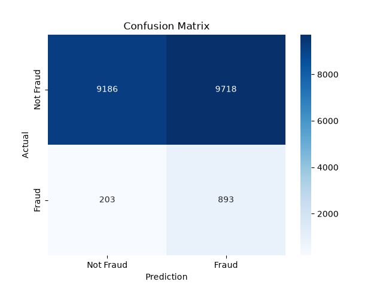
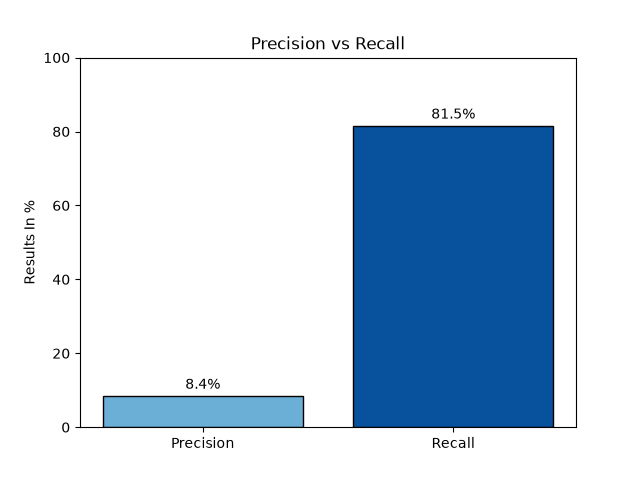
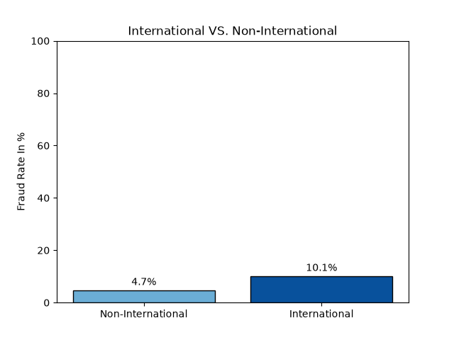
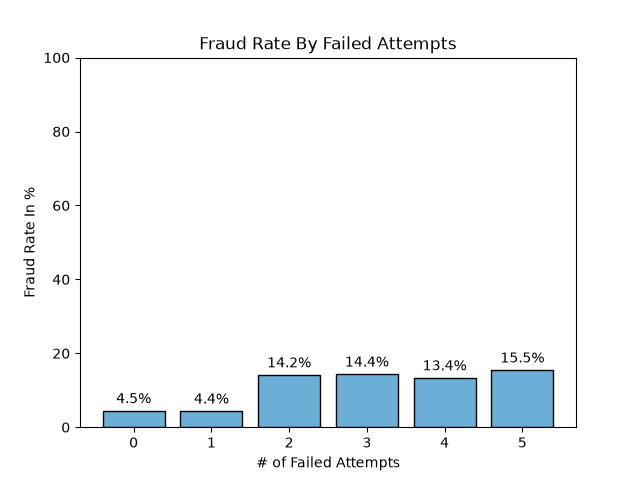

# Machine Learning Fraud Detection Model

## Project overview
The dataset was 100,000 rows 5.5% fraud rate. I split the data in 80/20 split. 80 for training and 20 for testing. This project was about 
creating a machine learning model that detects financial fraud. It classifies each transaction as fraud or not fraud. I first cleaned
the sample data to help the model get the best results it can. The model I used was random forest classifier. From all the available
classification models this one yielded the best results. 

## Motivation
Fraud is one of the biggest things that affects banks profit and reputability. When customers get scammed they lose trust in their banks
which can lead to churning. By creating a successful fraud model companies can avert these scenarios and keep their loyal customers.

## Methodology
1. I first went through all the columns of each transaction to see the best indication of fraud and created a refined dataset for the model.
  - I created two functions:
    - 1st function: It found the mean fraud rate of each column using its column's categories.
    - 2nd function: The second function categorized a column's values into 4 categories called bins based on the percentile spread.
    I used this function for continuous data that was not split into categories. I then would create a new column and then put it into
    the 1st function to see the the fraud rate within those bins.
2. I then created the model and then put the new refined dataset to get the best results.
    - 1st: I made sure to create the x(all columns) and y(is_fraud column) values for the model.
    - 2nd: I then split the data into the 80/20 train/test split and made sure that the fraud rate was still 5.5% in both of the splits.
    - 3rd: I then split the data into categorical and numerical and scaled the numerical columns and encoded the categorical
      columns so the model can understand those categories and not skew the numerical ones.
    - 4th: I then trained the 80 percent with my random forest classifier pipeline and used GridSearchCV to find the best parameters
      and tested the model with the 20%.
    - 5th: I also made the threshold 45% instead of 50% for the best results since catching fraud matters more to a bank
      than minimizing false alarms, even if it leads to some false alarms though I did try everything between this
      yielded the best results.

## Results
*81% recall and 8% precision*
- This means it catches 81% of those 5% which is recall but it has many transactions where it mistakenly identifies it as fraud which is the precision.
- I have a 2x2 confusion matrix to map this finding, precision versus recall graph, and have two of the best fraud indicating columns even though the dataset did not have the best fraud indicators.

- **Having international compared to non international transactions has more than double the fraud rate and as you have more failed attempts when trying to login to a customer account the more likely that transaction was fraud.** This data can help companies make their fraud detection model to match with the findings of data.

## Technical skills used: 
- Python: programming language used
- Pandas: For EDA and data cleaning
- numpy: For numerical arrays used for visualizations
- scikit-learn: For machine learning model
- matplotlib: For bar charts
- seaborn: for 2x2 confusion matrix
- pathlib: For file management

## How to Run:
- install python libraries: "pip install pandas numpy matplotlib seaborn scikit-learn"
- Run EDA.py first, then fraud_model.py, lastly Visuals_scr.py
   File paths work for anyone, just run it as they are.

## Future improvements:
- choose better learning models to find more nuanced indicators.

